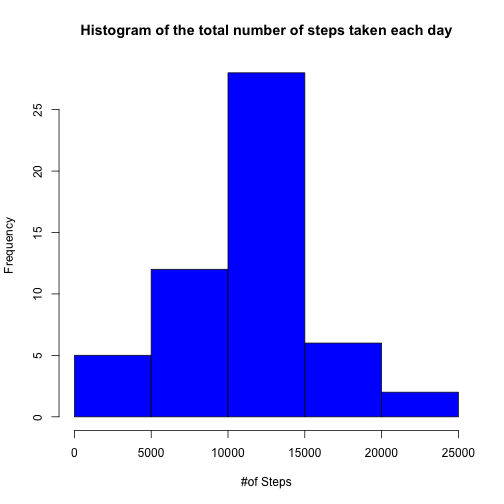
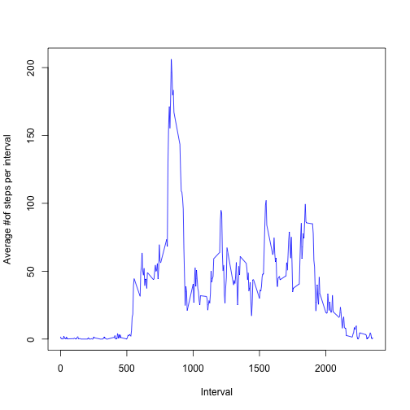
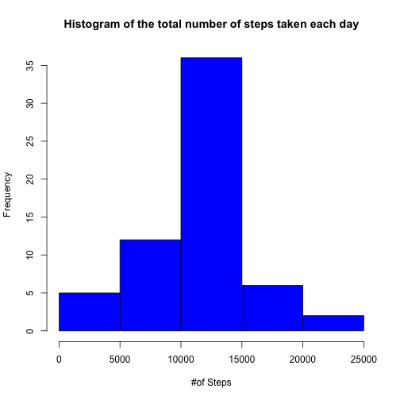
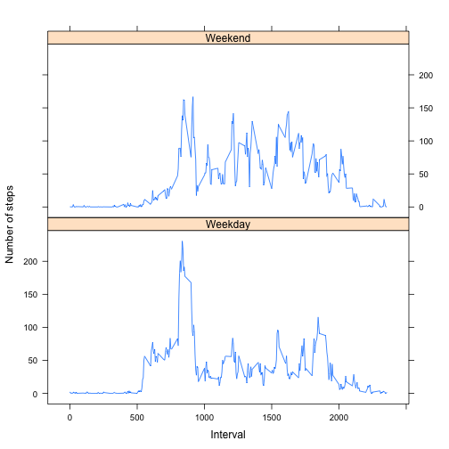

## Loading and preprocessing the data

- Unzip and Read CSV file activity.csv 


```r
  activitydf = read.csv(unz("activity.zip", "activity.csv"), colClasses=c("integer", "Date", "integer"))
```

## What is mean total number of steps taken per day?

- Histogram of the total number of steps taken each day


```r
  library(dplyr)
  
  activitydf_perday <- 
    activitydf %>% group_by(date) %>% summarize(stepsperday=sum(steps))
  
  hist(activitydf_perday$stepsperday, 
       col="blue", 
       xlab="#of Steps", 
       main="Histogram of the total number of steps taken each day")
```

 

- Mean of total #of steps taken per day


```r
  mean <- mean(activitydf_perday$stepsperday, na.rm=TRUE)
  print(mean)
```

```
## [1] 10766.19
```

- Median of total #of steps taken per day


```r
  median <- median(activitydf_perday$stepsperday, na.rm=TRUE)
  print(median)
```

```
## [1] 10765
```

## What is the average daily activity pattern?


```r
  library(dplyr)
  
  activitydf_perinterval <- 
    activitydf %>% group_by(interval) %>% summarize(stepsperinterval=mean(steps, na.rm=TRUE))

  plot(activitydf_perinterval$interval, activitydf_perinterval$stepsperinterval, 
     type="l",
     col="blue",  
     ylab="Average #of steps per interval", 
     xlab="Interval")
```

 

- Which 5-minute interval, on average across all the days in the dataset, contains the maximum number of steps?


```r
  activitydf_perinterval$interval[which.max(activitydf_perinterval$stepsperinterval)]
```

```
## [1] 835
```

## Imputing missing values

- the total number of missing values in the dataset (i.e. the total number of rows with NAs)


```r
  sum(is.na(activitydf$steps))
```

```
## [1] 2304
```

- Strategy for filling in missing values - use the mean of that interval through out the period and use that instead; apply this strategy on a copy of the original dataset


```r
  activitydf_copy <- activitydf
  activitydf_copy$steps[which(is.na(activitydf_copy$steps))] <- 
    ceiling(activitydf_perinterval$stepsperinterval[
      match(activitydf_copy$interval[which(is.na(activitydf_copy$steps))], 
            activitydf_perinterval$interval)])
```

- Histogram of the total number of steps taken each day for the new dataset


```r
  activitydf_copy_perday <- 
    activitydf_copy %>% group_by(date) %>% summarize(stepsperday=sum(steps))
  
  hist(activitydf_copy_perday$stepsperday, 
       col="blue", 
       xlab="#of Steps", 
       main="Histogram of the total number of steps taken each day")
```

 

- Mean of total #of steps taken per day


```r
  new_mean <- mean(activitydf_copy_perday$stepsperday, na.rm=TRUE)
  print(new_mean)
```

```
## [1] 10784.92
```

- Median of total #of steps taken per day


```r
  new_median <- median(activitydf_copy_perday$stepsperday, na.rm=TRUE)
  print(new_median)
```

```
## [1] 10909
```

- Do these values differ from the estimates from the first part of the assignment? What is the impact of imputing missing data on the estimates of the total daily number of steps?

There is only a minor difference from previous mean (1.0766189 &times; 10<sup>4</sup>) and median (10765) values to the mean (1.0784918 &times; 10<sup>4</sup>) and median (1.0909 &times; 10<sup>4</sup>) values after missing data filled in. Imputing missing data did not make a big difference on the histogram of daily number of steps, but amplified the frequency consistently over the period of observation duration.

## Are there differences in activity patterns between weekdays and weekends?

- Create a new factor variable in the dataset with two levels – “weekday” and “weekend” indicating whether a given date is a weekday or weekend day.


```r
  activitydf_copy$daytype <- 
    ifelse(weekdays(activitydf_copy$date) %in% c("Saturday", "Sunday"), 
           "Weekend", 
           "Weekday")
```

- Make a panel plot containing a time series plot (i.e. type = "l") of the 5-minute interval (x-axis) and the average number of steps taken, averaged across all weekday days or weekend days (y-axis). See the README file in the GitHub repository to see an example of what this plot should look like using simulated data.


```r
  activitydf_copy_perintervaldaytype <- 
    activitydf_copy %>% 
      group_by(interval, daytype) %>% 
      summarize(meanstepsperdaytype=mean(steps))

  xyplot(activitydf_copy_perintervaldaytype$meanstepsperdaytype ~ activitydf_copy_perintervaldaytype$interval | activitydf_copy_perintervaldaytype$daytype, 
         type="l", 
         layout=c(1,2), 
         ylab="Number of steps", 
         xlab="Interval")
```

 

